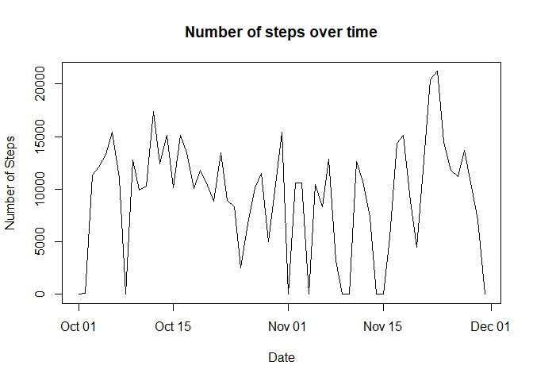
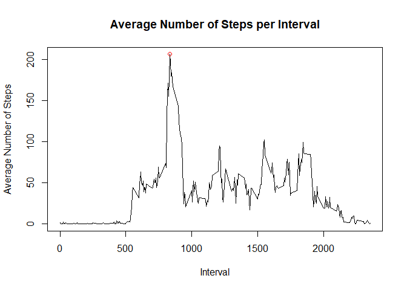
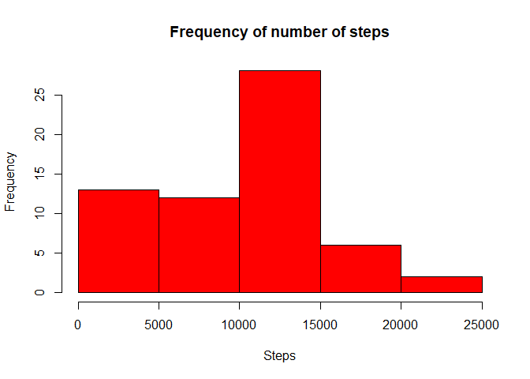

## Loading and preprocessing the data
First we include the necessary libraries (*data.table* and *lattice*), then load the data and convert the date feature from a string to a Date. Note that the csv file should be extracted and in the working directory.

```r
# Import required libraries
library(data.table)
library(lattice)

# load the data
data <- fread('activity.csv')
# convert the date feature from char to date
data$date <- as.Date(data$date)
```


## What is mean total number of steps taken per day?
Next we calculate the mean and median number of steps per day, ignoring NA values, and plot a histogram of the steps per day values.

```r
# Calculate total number of steps per day
steps_per_day <- aggregate(data$steps,list(data$date), sum, na.rm = TRUE)
names(steps_per_day) <- c("date", "steps")
# Histogram of number of steps per day
hist(steps_per_day$steps, col = "red", xlab = "Steps",main = "Frequency of number of steps")
```

<!-- -->

```r
# Calculate mean and median number of steps per day
mean_spd <- mean(steps_per_day$steps, na.rm = TRUE)
median_spd <- median(steps_per_day$steps, na.rm = T)
print(mean_spd)
```

```
## [1] 9354.23
```

```r
print(median_spd)
```

```
## [1] 10395
```
We also evaluate how the total number of steps per day has changed throughout the monitoring period.

```r
# Plot time series of steps per day
plot(steps_per_day$date,steps_per_day$steps,type = 'l', xlab = "Date", ylab = "Number of Steps", main = "Number of steps over time")
```

<!-- -->

## What is the average daily activity pattern?
We then calculate the average number of steps for each interval, ignoring NA values, and plot this. We also locate the interval with the maximum average, and plot this.

```r
# Calculate average number of steps per interval, for now just omit the NA values
mean_spi <- aggregate(data$steps, list(data$interval),mean, na.rm=TRUE)
names(mean_spi) <- c("interval", "steps")
# Find the interval with the most steps on average
max_interval <- which.max(mean_spi$steps)

# Plot the number of steps per interval and the max
plot(mean_spi$interval, mean_spi$steps,type ='n', xlab= "Interval", 
     ylab = "Average Number of Steps", main = "Average Number of Steps per Interval")
points(mean_spi$interval, mean_spi$steps,type ='l')
points(mean_spi$interval[max_interval], mean_spi$steps[max_interval],type ='o', col ="red")
```

<!-- -->

The interval with the max number of steps is 835.

## Imputing missing values
First we calculate the total number of NA values.

```r
# Report the number of NA values
sum(is.na(data$steps))
```

```
## [1] 2304
```
We then impute the missing data by replacing NA values with the median value for the corresponding interval and day of the week

```r
# First aggregate the data by the day of the week and the interval
median_spdi <- as.data.table(aggregate(data$steps, list(weekdays(data$date),data$interval),median,na.rm=TRUE))
names(median_spdi) <- c("weekday","interval", "median_steps")
# Add a weekday column to the original data so we can match
data$weekday <- weekdays(data$date)
# Combine the median and original data tables
setkey(data,weekday,interval)
setkey(median_spdi,weekday,interval)
data <- median_spdi[data] 
# Then replace the NA values with the appropriate value
data$steps[is.na(data$steps)] <- data$median_steps[is.na(data$steps)]
```
And recalculate the number of NA values.

```r
# Report the number of NA values
sum(is.na(data$steps))
```

```
## [1] 0
```

We then repeat the analysis with the imputed values.

```r
# Repeat histogram of number of steps per day
steps_per_day <- aggregate(data$steps,list(data$date),sum)
names(steps_per_day) <- c("date", "steps")
# Histogram of number of steps per day
hist(steps_per_day$steps, col = "red", xlab = "Steps",main = "Frequency of number of steps")
```

<!-- -->

```r
# Calculate mean and median number of steps per day
mean_spd_new <- mean(steps_per_day$steps)
median_spd_new <- median(steps_per_day$steps)
```
The previous mean steps per day was 9354.2295082, the new mean is 9705.2377049. 
The previous median steps per day was 10395, the new median is 1.0395\times 10^{4}.

## Are there differences in activity patterns between weekdays and weekends?
Finally, plot the difference between average interval-step patterns on the weekend and weekdays.

```r
# Designate weekday or weekend
data$weekend <- factor(data$weekday %in% c("Saturday", "Sunday"), labels = c("Weekday","Weekend"))
mean_spiw <- aggregate(data$steps, list(data$weekend,data$interval), mean)
names(mean_spiw) <- c("weekend", "interval", "steps") 
# Plot the average number of steps during the week and on weekends
xyplot( steps~interval | weekend, data = mean_spiw, type='l',ylab = "Number of Steps", xlab = "Interval", layout = c(1,2))
```

<!-- -->
